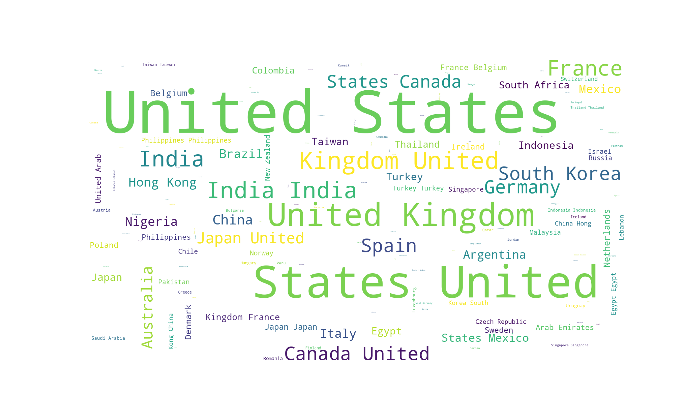

 <h1 align="center" style="color:blue">
 Netflix Data Analyze
</h1>

 <h3 align="center" style="color:yellow">
 Netflix Cast Analyze
 </h3>

<h2>
 <a href="./netflix.ipynb" style=" color:lightblue; cursor:pointer;">
Go To Code 
</a>
</h2>

 
 
 

 <h3 align="center" style="color:yellow">
 Netflix Directory Analyze
 </h3>

<h2>
 <a href="./netflix.ipynb" style=" color:lightblue; cursor:pointer;">
Go To Code 
</a>
</h2>

 
 
 

 <h3 align="center" style="color:yellow">
 Netflix Country Analyze
 </h3>

<h2>
 <a href="./netflix.ipynb" style=" color:lightblue; cursor:pointer;">
Go To Code 
</a>
</h2>

 
 
<h2 align="center">
<a style="color:gray; cursor:pointer" href="https://www.kaggle.com/datasets/shivamb/netflix-shows" target="_blank">
Dataset
</a>
</h2>